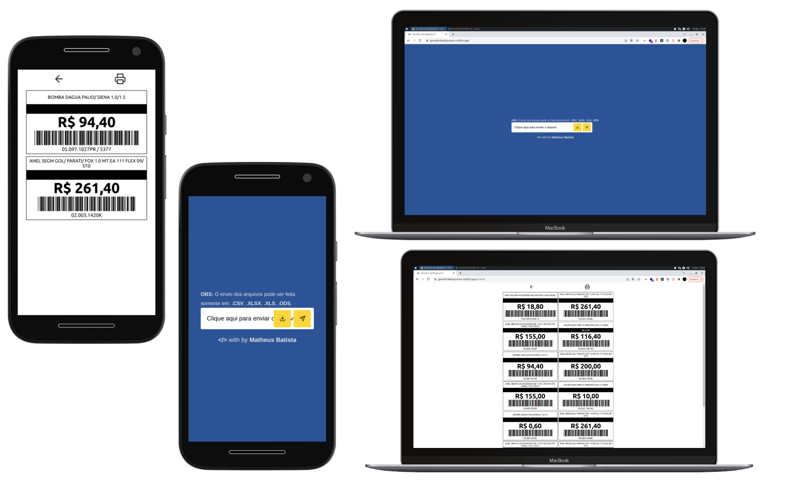

[](https://twitter.com/t_h_e_u) 
[](https://www.linkedin.com/in/matheusgbatista/) 
[](https://t-heu.github.io) 

# Screenshot
<p align="center">
  
</p>

# Benefícios
- Prático e rápido.
- Cálculo automático de preço quando a peça for jogo.
- Padronização de modelo fixo, sem ter problemas de desconfiguração do modelo como por exemplo: largura maior ou menor, fontes, borda ou cor.

# Observações
- Caso uma impressão de um arquivo PDF fique um pouco menor procure marca a caixinha de "imprimir tamanho real".

# Instalação
- at the root
```shell
npm i or yarn
```
- at the root of the `/electron` folder
```shell
npm i or yarn
```

# Como excutar
- run electron build or dev
```shell
sh start.sh
```
- build the program based on the system you are on:
- run in `/electron` folder
```shell
npm run make or yarn make
```
- run web only
```shell
npm run start or yarn start
```
